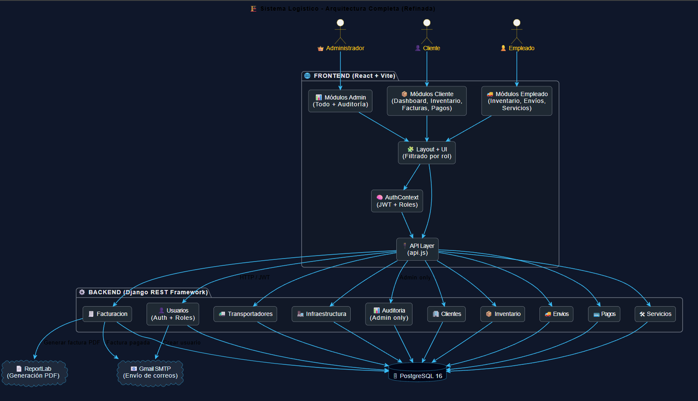
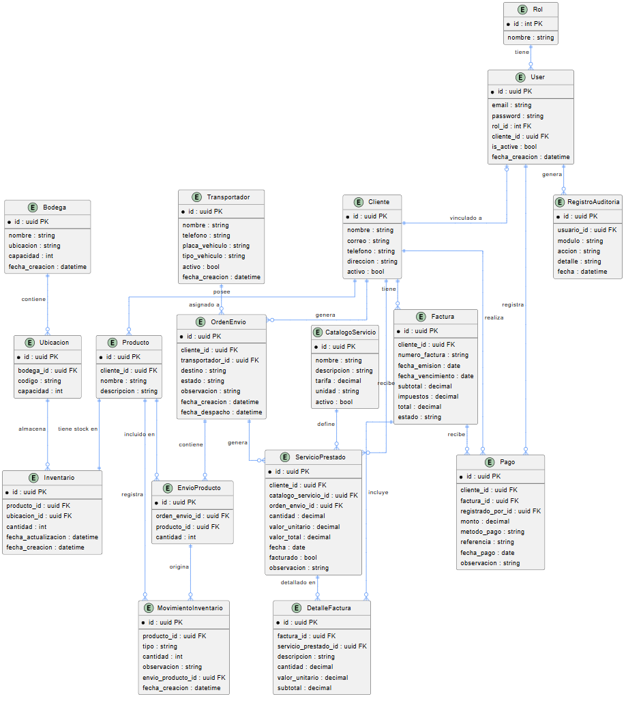
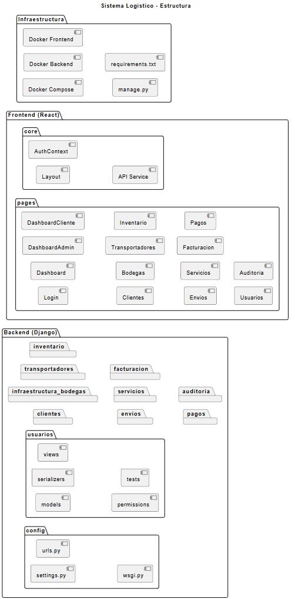

# BodegaXpress — Sistema de Gestión Logística
> Plataforma full-stack para la gestión integral de bodegas, inventario, envíos y facturación de servicios logísticos. Desarrollada con Django REST Framework + React + PostgreSQL.
---
## Tabla de contenido

- [Descripción general](#descripción-general)
- [Stack tecnológico](#stack-tecnológico)
- [Arquitectura del sistema](#arquitectura-del-sistema)
- [Módulos y funcionalidades](#módulos-y-funcionalidades)
- [Modelo de datos](#modelo-de-datos)
- [API REST](#api-rest)
- [Autenticación y roles](#autenticación-y-roles)
- [Pruebas unitarias](#pruebas-unitarias)
- [Inicio rápido](#inicio-rápido)
- [Variables de entorno](#variables-de-entorno)
- [Estructura del proyecto](#estructura-del-proyecto)

---
## Descripción general

BodegaXpress es un sistema de gestión logística diseñado para empresas de almacenamiento y distribución. Permite administrar el ciclo completo de operaciones: desde la recepción de mercancía hasta su despacho, pasando por el control de inventario, la facturación de servicios y el registro de pagos.

El sistema opera con tres roles diferenciados — **administrador**, **empleado** y **cliente** — cada uno con acceso controlado a los módulos correspondientes.

**Funcionalidades principales:**

- Control de inventario en tiempo real con registro de entradas y salidas
- Gestión de órdenes de envío con despacho automático que descuenta stock
- Facturación automática agrupando servicios prestados pendientes
- Envío de correo electrónico con credenciales al crear usuarios
- Cambio de contraseña desde el login
- Auditoría completa de todas las acciones del sistema
- Generación y descarga de facturas en PDF
- Dashboard con métricas en tiempo real por rol

---

## Stack tecnológico

| Capa | Tecnología | Versión |
|------|-----------|---------|
| Backend | Python + Django + DRF | 3.13 / 5.0 / 3.15 |
| Base de datos | PostgreSQL | 16 |
| Frontend | React + Vite | 18 / 5 |
| Autenticación | JWT (SimpleJWT) | 5.3 |
| Documentación API | drf-spectacular (Swagger) | 0.27 |
| Infraestructura | Docker + Docker Compose | — |
| Correo | Gmail SMTP | — |
| PDF | ReportLab | 4.x |

---

## Arquitectura del sistema


## Módulos y funcionalidades

### Usuarios y autenticación
- Login con JWT via email (no username)
- Roles: `admin`, `empleado`, `cliente`
- Creación de usuarios con contraseña temporal generada automáticamente
- Envío de correo de bienvenida con credenciales al crear usuario
- Cambio de contraseña desde el login (modal integrado)
- Endpoint `me/` para obtener datos del usuario autenticado
- Token con `rol` y `cliente_id` embebidos para uso en el frontend

### Clientes
- CRUD completo de clientes empresariales
- Vinculación opcional entre `User` y `Cliente` para acceso restringido
- Filtrado por estado activo/inactivo

### Infraestructura de Bodegas
- Gestión de bodegas con capacidad total
- Ubicaciones con código único por bodega y capacidad individual
- Validación de capacidad disponible al asignar productos

### Inventario
- Registro de productos vinculados a clientes y ubicaciones
- Control de stock con validación de capacidad de ubicación
- Movimientos de entrada y salida con trazabilidad completa
- Creación de producto + inventario + movimiento en una sola llamada
- Descuento automático de stock al despachar órdenes de envío

### Envíos
- Órdenes de envío con estados: `pendiente → preparando → en_transito → entregado`
- Múltiples productos por orden con cantidades individuales
- Endpoint `despachar/` que ejecuta atómicamente:
  - Validación de stock por producto
  - Descuento de inventario
  - Creación de movimientos de salida
  - Generación automática de `ServicioPrestado`
- Solo se pueden eliminar productos de órdenes en estado `pendiente`

### Servicios
- Catálogo de servicios con tarifas por unidad (`por_dia`, `por_envio`, `por_recepcion`, `unitario`)
- Registro de servicios prestados con cálculo automático de `valor_total`
- Filtros por cliente, estado de facturación y rango de fechas
- Los servicios se generan automáticamente al despachar envíos y al registrar recepciones

### Transportadores
- CRUD completo de transportadores
- Registro de placa, tipo de vehículo y estado activo/inactivo
- Asignación a órdenes de envío
- Filtrado por estado activo

### Facturación
- Generación de facturas agrupando todos los `ServicioPrestado` pendientes de un cliente
- Selección opcional de servicios específicos para incluir
- Cálculo automático de subtotal, IVA (19%) y total
- Estados: `pendiente`, `pagada`, `vencida`
- Descarga de factura en PDF con diseño profesional
- Envío de correo HTML al marcar factura como pagada
- Acceso restringido: el cliente solo ve sus propias facturas

### Pagos
- Registro de pagos con método (`efectivo`, `transferencia`, `cheque`, `tarjeta`)
- Vinculación a factura específica
- Al registrar un pago, la factura se marca automáticamente como pagada
- Solo lectura para clientes (ven únicamente sus pagos)

### Auditoría
- Registro automático de todas las acciones relevantes del sistema
- Filtros por módulo, usuario, rango de fechas y búsqueda libre
- Solo accesible para administradores
- Vista de solo lectura (no permite crear, editar ni eliminar)

---

## Modelo de datos


## API REST

| Módulo | Endpoint | Métodos |
|--------|---------|---------|
| Auth | `/api/auth/login/` | POST |
| Auth | `/api/auth/refresh/` | POST |
| Auth | `/api/auth/logout/` | POST |
| Auth | `/api/auth/me/` | GET |
| Auth | `/api/auth/crear/` | POST |
| Auth | `/api/auth/cambiar-password/` | POST |
| Auth | `/api/auth/usuarios/` | GET, POST, PUT, PATCH, DELETE |
| Clientes | `/api/clientes/` | GET, POST, PUT, PATCH, DELETE |
| Bodegas | `/api/infraestructura/bodegas/` | GET, POST, PUT, PATCH, DELETE |
| Ubicaciones | `/api/infraestructura/ubicaciones/` | GET, POST, PUT, PATCH, DELETE |
| Transportadores | `/api/transportadores/` | GET, POST, PUT, PATCH, DELETE |
| Productos | `/api/inventario/productos/` | GET, POST, PUT, PATCH, DELETE |
| Inventarios | `/api/inventario/inventarios/` | GET |
| Movimientos | `/api/inventario/movimientos/` | GET, POST |
| Órdenes | `/api/envios/ordenes/` | GET, POST, PUT, PATCH, DELETE |
| Despachar | `/api/envios/ordenes/{id}/despachar/` | POST |
| Prod. envío | `/api/envios/ordenes/{id}/productos/` | GET, POST, DELETE |
| Catálogo | `/api/servicios/catalogo/` | GET, POST, PUT, PATCH, DELETE |
| Servicios | `/api/servicios/prestados/` | GET, POST |
| Facturas | `/api/facturacion/facturas/` | GET, POST, DELETE |
| Generar | `/api/facturacion/facturas/generar/` | POST |
| Marcar pagada | `/api/facturacion/facturas/{id}/marcar_pagada/` | POST |
| PDF | `/api/facturacion/facturas/{id}/pdf/` | GET |
| Pagos | `/api/pagos/` | GET, POST |
| Auditoría | `/api/auditoria/` | GET |

Documentación interactiva Swagger disponible en: **`/api/docs/`**

---

## Autenticación y roles

El sistema usa JWT con el email como campo de autenticación principal. El token incluye el rol y el `cliente_id` del usuario para que el frontend pueda tomar decisiones de navegación sin llamadas adicionales.

```
admin     → acceso total a todos los módulos
empleado  → inventario, envíos, movimientos, servicios
cliente   → solo lectura de sus propios datos (facturas, pagos, inventario)
```

**Flujo de autenticación:**

```
POST /api/auth/login/  →  { access, refresh }
GET  /api/auth/me/     →  { id, email, rol, cliente_id, ... }
POST /api/auth/refresh/ →  { access }
POST /api/auth/logout/  →  blacklist del refresh token
```

---

## Pruebas unitarias

El proyecto cuenta con una suite completa de pruebas unitarias e integración organizadas por módulo. Cada módulo tiene su propia carpeta `tests/` con archivos separados por capa.

**Cobertura total: 571 pruebas**

| Módulo | Models | Serializers | Views | URLs | Utils | Total |
|--------|--------|-------------|-------|------|-------|-------|
| inventario | 22 | 23 | 30 | 13 | — | **88** |
| facturacion | 19 | 16 | 28 | 11 | — | **74** |
| envios | 22 | 16 | 23 | 12 | — | **73** |
| pagos | 17 | 11 | 14 | 5 | — | **47** |
| servicios | 25 | 16 | 16 | 11 | — | **68** |
| transportadores | 14 | 12 | 16 | 5 | — | **47** |
| auditoria | 17 | 11 | 14 | 5 | 7 | **54** |
| usuarios | 22 | 13 | 28 | 16 | — | **79** |

**Ejecutar todas las pruebas:**

```bash
python manage.py test --verbosity=2
```

**Ejecutar por módulo:**

```bash
python manage.py test inventario.tests --verbosity=2
python manage.py test facturacion.tests --verbosity=2
python manage.py test envios.tests --verbosity=2
python manage.py test pagos.tests --verbosity=2
python manage.py test servicios.tests --verbosity=2
python manage.py test transportadores.tests --verbosity=2
python manage.py test auditoria.tests --verbosity=2
python manage.py test usuarios.tests --verbosity=2
python manage.py test clientes.tests --verbosity=2
python manage.py test infraestructura_bodegas.tests --verbosity=2
```

**Ejecutar un archivo específico:**

```bash
python manage.py test inventario.tests.test_views --verbosity=2
```

**Ejecutar un test individual:**

```bash
python manage.py test inventario.tests.test_views.MovimientoInventarioViewSetTest.test_entrada_aumenta_stock --verbosity=2
```
---

## Inicio rápido

### Con Docker (recomendado)

```bash
# Clonar repositorio
git clone https://github.com/jmarquezdev20/sistema-logistico.git
cd sistema-logistico

# Levantar contenedores
docker-compose up --build

# En otra terminal — aplicar migraciones y crear superusuario
docker-compose exec backend python manage.py migrate
docker-compose exec backend python manage.py createsuperuser
```

### Sin Docker (desarrollo local)

```bash
# 1. Crear entorno virtual
python -m venv venv
venv\Scripts\activate        # Windows
source venv/bin/activate     # Linux/Mac

# 2. Instalar dependencias
pip install -r requirements.txt

# 3. Configurar variables de entorno (ver sección siguiente)

# 4. Aplicar migraciones
python manage.py migrate

# 5. Crear roles base
python manage.py shell -c "
from usuarios.models import Rol
for nombre in ['admin', 'empleado', 'cliente']:
    Rol.objects.get_or_create(nombre=nombre)
    print(f'Rol {nombre} listo')
"

# 6. Crear superusuario admin
python manage.py shell -c "
from usuarios.models import User, Rol
rol = Rol.objects.get(nombre='admin')
user = User.objects.create_superuser(
    username='admin@bodegaxpress.com',
    email='admin@bodegaxpress.com',
    password='admin1234',
    rol=rol
)
print(f'Admin creado: {user.email}')
"

# 7. Levantar servidor backend
python manage.py runserver

# 8. En otra terminal — levantar frontend
cd frontend
npm install
npm run dev
```

### URLs de acceso

| Servicio | URL |
|---------|-----|
| Frontend | https://sistema-logistico-frontend.onrender.com/login |
| API REST | https://sistema-logistico-1-pxsm.onrender.com/api/ |
| Swagger | https://sistema-logistico-1-pxsm.onrender.com/api/docs/|
| Admin Django | https://sistema-logistico-1-pxsm.onrender.com/admin/ |

---

> **Nota:** Para Gmail, activa la verificación en dos pasos y genera una contraseña de aplicación en: Google Account → Seguridad → Contraseñas de aplicación.

---

## Estructura del proyecto


---

## Flujos clave del sistema

### Flujo de despacho automático

```
1. Crear OrdenEnvio  →  POST /api/envios/ordenes/
2. Agregar productos →  POST /api/envios/ordenes/{id}/productos/
3. Despachar         →  POST /api/envios/ordenes/{id}/despachar/
   └── Valida stock por producto
   └── Descuenta inventario atómicamente
   └── Crea MovimientoInventario(tipo=salida) por producto
   └── Genera ServicioPrestado automáticamente
   └── Cambia estado a en_transito
```

### Flujo de facturación

```
1. Servicios se generan automáticamente al:
   - Despachar una orden  →  ServicioPrestado(por_envio)
   - Registrar recepción  →  ServicioPrestado(por_recepcion)
   - Registrar almacenamiento manual

2. Generar factura  →  POST /api/facturacion/facturas/generar/
   └── Agrupa todos los ServicioPrestado(facturado=False) del cliente
   └── Calcula subtotal + IVA 19% + total
   └── Crea DetalleFactura por cada servicio
   └── Marca servicios como facturado=True

3. Registrar pago   →  POST /api/pagos/
   └── Valida que la factura no esté ya pagada
   └── Marca factura como pagada
   └── Envía correo HTML de confirmación con PDF adjunto
```

### Flujo de creación de usuario

```
1. Admin crea usuario  →  POST /api/auth/crear/
   └── Genera contraseña temporal con secrets.token_urlsafe()
   └── Crea User con rol asignado
   └── Vincula Cliente si rol=cliente
   └── Envía correo HTML con credenciales
   └── Retorna password_temporal para que el admin la comparta

2. Usuario inicia sesión con contraseña temporal
3. Cambia contraseña  →  POST /api/auth/cambiar-password/
```

---

*Desarrollado por Juan Manuel Márquez — Barranquilla, Colombia*